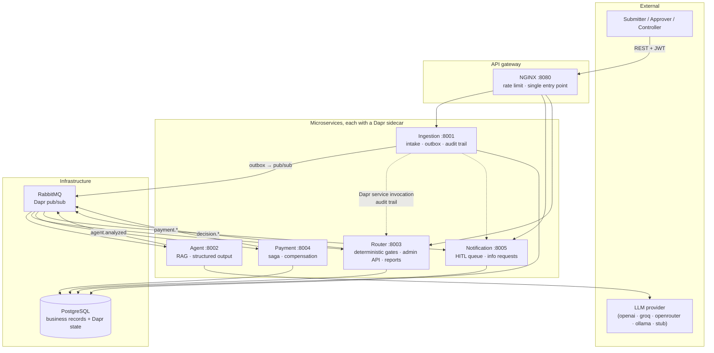

# ApprovalFlow — AI-Assisted Invoice & Expense Approval Platform

**ApprovalFlow** ingests invoices and expenses, has an AI agent analyse each one against a
configurable company policy, **auto-approves the low-risk majority** and **escalates the
risky, unclear or high-value minority to a human**. Approved items run through a
compensating payment saga, and every decision is auditable end to end by one correlation id.

> **The guiding principle:** the agent **recommends**, the deterministic router **decides**.
> The router has no LLM library in its dependencies, so it is *physically* incapable of
> asking a model what to do.

---

## Architecture



Full sequence and payment-compensation diagrams: [`docs/ARCHITECTURE.md`](docs/ARCHITECTURE.md).
The autonomy posture and its justification: [`docs/PRODUCT-DILEMMA.md`](docs/PRODUCT-DILEMMA.md).

## Services

| # | Service | Port | Responsibility |
|---|---------|------|----------------|
| 1 | **Ingestion** | 8001 | Accepts submissions, converts FX, reconciles the maths, detects business duplicates in one transaction, writes the **transactional outbox**, serves status and the **full audit trail** |
| 2 | **Agent** | 8002 | **Retrieves the relevant policy clauses (RAG)** and asks the LLM for a structured recommendation. Never decides |
| 3 | **Router** | 8003 | The deterministic gate chain, the **admin policy API**, the **dashboard** and the **ceiling proof**. Zero AI |
| 4 | **Payment** | 8004 | Saga orchestrator: reserve budget → execute → confirm, with a compensation for each step |
| 5 | **Notification** | 8005 | Event observer, approver queue, approve / reject / **send back for more info** |

## Event flow

```
submission.received ─► agent.analyzed ─► decision.{auto_approved,escalated,rejected,duplicate}
                                              │                    │
                                              ▼                    ▼
                                         payment.*            notification
                                    (completed/failed/          (queue)
                                      compensated)                 │
                                                                   ▼
        submission.info_provided ◄── approval.action_received ◄── approver
                    │                  (approve/reject/send_back)
                    └──► re-analysis at the next revision, same correlation id
```

## Quick start

**Prerequisites:** Docker Desktop (with WSL2 on Windows). An LLM API key is *optional* —
`LLM_PROVIDER=stub` runs every path deterministically with no network calls.

```bash
cp .env.example .env       # optional: add a real LLM_API_KEY
docker compose up -d       # 18 containers: 5 apps + 5 Dapr sidecars + placement, postgres,
                           # rabbitmq, zipkin, gateway, ui and 2 one-shot init containers
```

Open the UI at <http://localhost:3000>. The API gateway is the only external entry point,
on <http://localhost:8080>.

> **Restarting one service?** Restart its Dapr sidecar with it:
> `docker compose restart router router-dapr`. Each sidecar joins its application's network
> namespace (`network_mode: "service:<app>"`), so restarting the application alone leaves the
> sidecar attached to a namespace that no longer exists — both containers still report "Up",
> but events stop flowing and submissions sit at `received`. `scripts/verify.py` already
> restarts them in pairs.

| What | Where |
|---|---|
| UI (submit · track · approve · dashboard · policy admin) | <http://localhost:3000> |
| API gateway | <http://localhost:8080> |
| OpenAPI / Swagger UI per service | <http://localhost:8001/docs> … `:8005/docs` |
| RabbitMQ management | <http://localhost:15672> (`approvalflow` / `approvalflow`) |

### Get a token (N1)

Roles are `submitter`, `approver`, `admin`. Authentication is on by default; set
`AUTH_ENABLED=false` to turn it off for a demo.

```bash
TOKEN=$(curl -s -X POST http://localhost:8080/api/auth/token \
  -H 'Content-Type: application/json' \
  -d '{"subject":"dana@northwind.example","roles":["submitter"]}' | jq -r .access_token)
```

This endpoint is the development identity provider — a real deployment would federate to a
real one. It is the only place in the system that mints tokens.

### Submit an invoice (F1)

```bash
curl -X POST http://localhost:8080/api/submissions \
  -H "Content-Type: application/json" -H "Authorization: Bearer $TOKEN" \
  -H "Idempotency-Key: my-unique-key-1" \
  -d '{
    "submitter": "dana@northwind.example",
    "department": "engineering-2026Q2",
    "vendor": "Bistro 19", "vendorKnown": true,
    "invoiceNumber": "NW-INV-001", "currency": "USD",
    "category": "meals", "attendees": 1,
    "lineItems": [{"description": "Team lunch", "quantity": 1, "unitPrice": 38.89}],
    "taxAmount": 3.11, "total": 42, "receiptPresent": true
  }'
# → 202 {"correlation_id": "...", "status": "received", "idempotency_key": "..."}
```

### The other endpoints

| Requirement | Call |
|---|---|
| F2 status + plain-language reason | `GET /api/submissions/{cid}/status` |
| F4 escalation queue with the agent's rationale | `GET /api/approvals?status=pending` |
| F5 approve / reject / send back | `POST /api/approvals/{cid}/{approve\|reject\|send-back}` |
| F5 submitter answers an info request | `POST /api/submissions/{cid}/info-response` |
| F7 read / change policy + thresholds, no redeploy | `GET` / `PUT /api/admin/policy` |
| F7 change the policy prose the agent reasons over | `PUT /api/admin/policy-document` |
| F8 throughput, auto-vs-human, money split | `GET /api/reports/dashboard` |
| F9 the complete decision trail | `GET /api/submissions/{cid}/audit` |
| F10 proof nothing auto-approved above the ceiling | `GET /api/reports/ceiling-proof` |

## Verification (D5)

One command runs the four worked journeys **and** the anti-cheese guards, then prints
pass/fail and exits non-zero on failure:

```bash
npm run verify          # or: python scripts/verify.py
npm run verify:journey A   # a single journey: A, B, C or D
```

It checks:

- **Journey A** INV-1001 auto-approves with no human involvement;
- **Journey B** INV-1003 escalates, pauses **durably** (the script restarts the router
  mid-pause), then resumes on the approver's decision;
- **Journey C** INV-1007 is short-circuited as a duplicate and INV-1001 is still paid once;
- **Journey D** INV-1012 fails in payment and the saga compensates, leaving no reservation
  and the budget restored;
- **anti-cheese:** at least two items auto-approve with no human, an "approve me" note does
  not change any route, and the ceiling proof reports zero violations.

## Testing

```bash
pip install -e "services/shared/[dev]"
pip install -r services/agent/requirements.txt   # etc. per service

npm run test:unit          # ~165 tests, no Docker, no network
npm run test:integration   # needs PostgreSQL; self-skips when unreachable
npm run test:ui            # React component tests (vitest)
npm run lint               # ruff, configured by ruff.toml
npm run typecheck          # mypy
npm run check              # everything the CI gate runs
npm run eval               # B1 eval harness over the labelled fixtures
```

Layers (N6): **unit** for the decision logic, the rule engine, RAG retrieval, the outbox and
the provider layer; **integration** against a real PostgreSQL for the transactional
guarantees; **end-to-end** through `scripts/verify.py`; **UI** component tests.

## The dilemma, and why the ceiling holds (M12 / F10)

The posture is **tiered**: $750 for meals, travel and hardware; $350 for SaaS and anything
else; and a confidence bar of 0.85. Reasoning in
[`docs/PRODUCT-DILEMMA.md`](docs/PRODUCT-DILEMMA.md).

Five things make the ceiling hold rather than merely "be checked":

1. **The router cannot call a model.** No LLM library in `services/router/requirements.txt`.
2. **Configuration can only restrict.** A configured rule's outcome may be `human_review`,
   `reject` or `duplicate` — `auto_approve` is not a representable value. Ceilings are also
   clamped by `ABSOLUTE_MAX_CEILING_USD` compiled into the code, so no edit to the policy
   document can raise autonomy beyond it.
3. **The agent cannot shrink the amount.** The ceiling is applied to
   `max(amount at intake, amount the agent reports)`.
4. **The agent cannot re-label its way out.** The ceiling uses whichever candidate category
   is *stricter*, and the per-category rules of **both** candidates are evaluated.
5. **A broken policy escalates.** A rule that references an unknown fact raises, and the
   router turns that into a human review instead of "no violations found".

Evidence: `tests/unit/test_router_enforcement.py`, a Hypothesis property test in
`tests/unit/test_ceiling_property.py` that tries thousands of generated submissions with the
recommendation forced to `auto_approve` and confidence forced to `1.0`, and the live
`GET /api/reports/ceiling-proof`, which re-checks every auto-approved decision ever recorded
against the ceiling that was in force when it was made.

## Configuration

Everything that used to be a constant in Python now lives in
[`config/policy-config.json`](config/policy-config.json): FX rates, the per-category
ceilings, the confidence bar, the receipt threshold and the whole rule catalogue. That file
is only the **bootstrap** copy — the live copy is in the Dapr state store and is edited
through `PUT /api/admin/policy`, which every service picks up within seconds with no
rebuild and no restart (F7 / M13).

Secrets come from the **Dapr secret store** (`dapr/components/secrets.yaml`), with
environment variables as the fallback (M5).

## Technology

| Layer | Choice |
|---|---|
| Language | Python 3.12, FastAPI (async) |
| Distributed runtime | Dapr 1.14 — pub/sub, state, **secrets**, **service invocation** |
| Message broker | RabbitMQ 3.13 (durable, dead-lettering) |
| Database | PostgreSQL 16 — business records, outbox, and the Dapr state store |
| Gateway | NGINX — single entry point, rate + connection limiting |
| UI | React 19, Vite, Tailwind |
| LLM | Provider-agnostic: OpenAI, Groq, OpenRouter, Ollama, or a deterministic stub |
| Retrieval | BM25 over clause-level chunks, optional dense fusion — no vector-DB service |
| Auth | Self-signed JWT with roles (submitter / approver / admin) |
| CI/CD | GitHub Actions — ruff, mypy, unit + integration + UI tests, compose smoke test, then publishes images to GHCR |

## Repository layout

```
config/            policy + autonomy configuration (bootstrap copy)
dapr/              components: pub/sub, state, secrets, subscriptions
db/init/           schema applied on first boot
docs/              ARCHITECTURE, PRODUCT-DILEMMA, ADRs
eval/              B1 eval harness over the labelled fixtures
gateway/           NGINX configuration
scripts/verify.py  D5 one-command verification
services/          the five services + the shared library
tests/             unit · integration
ui/                React UI
```
