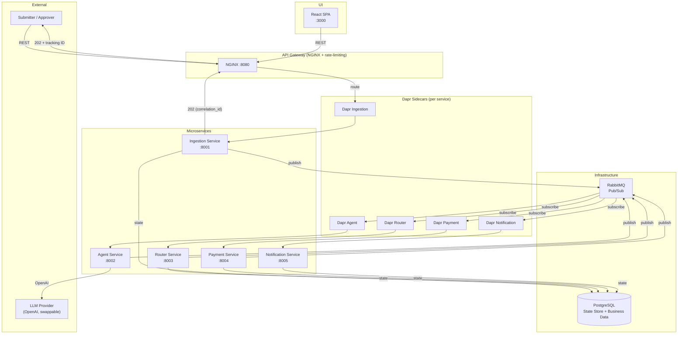
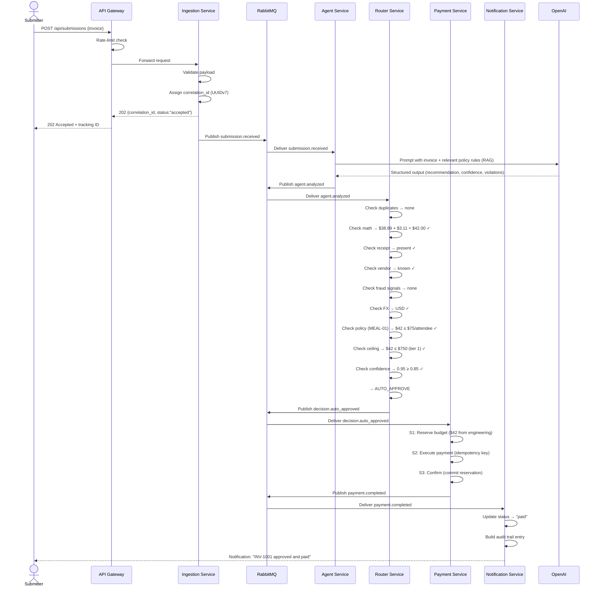
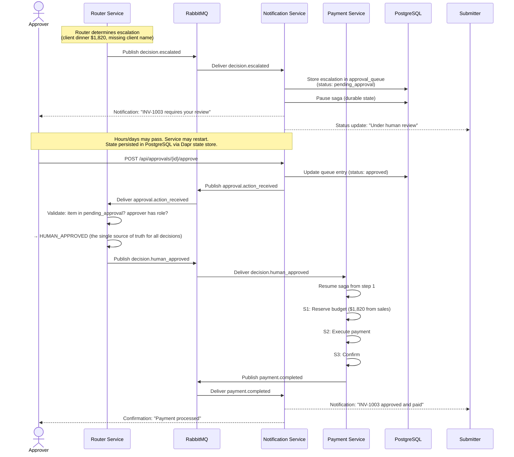
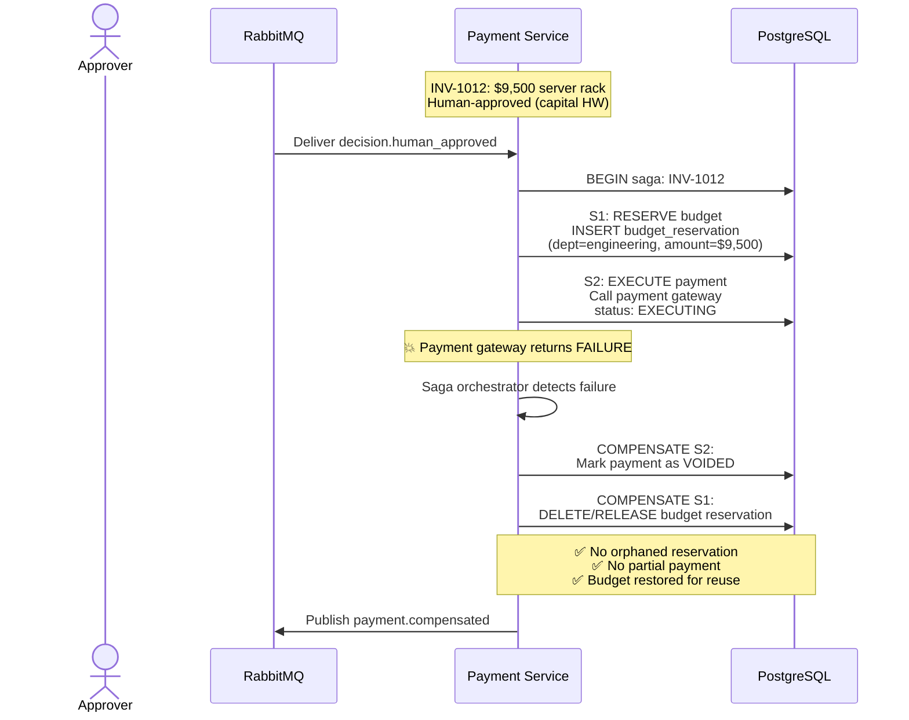

# ApprovalFlow — Architecture Document

> **ARCHITECTURE.md** — System design, component boundaries, sequence diagrams, and payment flow.
> Written for evaluation per requirement D1.

---

## Table of Contents

1. [System Overview](#1-system-overview)
2. [The Autonomy Dilemma](#2-the-autonomy-dilemma)
3. [Service Decomposition](#3-service-decomposition)
4. [Request Flow](#4-request-flow)
5. [Payment Saga](#5-payment-saga)
6. [Data Architecture](#6-data-architecture)
7. [Technology Stack](#7-technology-stack)
8. [Security & Cross-Cutting Concerns](#8-security--cross-cutting-concerns)
9. [Repository Structure](#9-repository-structure)

---

## 1. System Overview

**ApprovalFlow** is a microservice-based, AI-assisted SaaS platform that automates invoice and expense
approvals for large enterprises. The system ingests invoices, uses an AI agent to judge them against a
configurable company policy, and automatically approves simple, low-risk cases while escalating
ambiguous or high-value cases to a human.

### Guiding Principle

> The agent **recommends**. The deterministic router **decides**. The agent can never approve anything on its own.

This architectural separation (agent-service ≠ router-service) is the foundation for proving M12:
the system is *provably incapable* of auto-approving above the configured ceiling.

### System Diagram



> The UI polls the status endpoint through the gateway. There is no WebSocket: polling is
> honest about what it costs, and the notification channel that satisfies M8 is the status
> endpoint plus the `notification.notifications` record, not a pushed socket.

---

## 2. The Autonomy Dilemma

### Our Posture

| Parameter | Default | Our Choice | Rationale |
|-----------|---------|------------|-----------|
| `AUTONOMY-CEILING` | $250 flat | **Tiered**: $750 (meals/travel/hardware), $350 (saas/other) | A flat $250 ceiling auto-approves only 22% of the fixture set — it defeats the product. Tiered ceilings recognize that a $750 laptop is routine but a $350/month SaaS subscription is significant recurring spend. |
| `AUTONOMY-CONFIDENCE` | 0.80 | **0.85** | Raising confidence tightens the safety net to compensate for the higher monetary ceiling. The agent must be more certain before acting autonomously on larger amounts. |

### Hard Stops (Always Human)

These rules trigger escalation **regardless of amount or confidence**:

| Rule | Trigger |
|------|---------|
| `GLOBAL-VENDOR` | New/unknown vendor |
| `GLOBAL-FX` | Foreign currency item over $1,000 |
| `GLOBAL-MATH` | Line items + tax mismatch total |
| `GLOBAL-FRAUD` | Fraud pattern signals detected |
| `GLOBAL-RECEIPT` | Missing receipt for expense > $25 |
| `GLOBAL-DUP` | Duplicate submission (same vendor + invoiceNumber + total) |
| `HW-02` | Hardware > $1,000 (capital expense) |
| `TRAVEL-02` | Single travel expense > $1,500 |
| `TRAVEL-03` | First/business class travel |
| `MEAL-02` | Client entertainment > $500 without justification + client name |
| `MEAL-03` | Alcohol-only receipts (rejected, not escalated) |

### Evidence from Labeled Fixtures

| Ceiling Regime | Auto | Human | Reject/Dup | Auto Rate |
|----------------|------|-------|------------|-----------|
| $250 flat (default) | 4 | 14 | 2 | 22% |
| $350 flat | 5 | 13 | 2 | 28% |
| $500 flat | 6 | 12 | 2 | 33% |
| **Tiered ($750 / $350)** | **5** | **13** | **2** | **28%** |
| $750 flat | 8 | 10 | 2 | 44% |

Our tiered posture produces 5 auto-approved fixtures:

| Fixture | Category | Amount | Why It Auto-Approves |
|---------|----------|--------|---------------------|
| INV-1001 | meals | $42 | In-policy team lunch, known vendor, receipt present |
| INV-1002 | saas | $99 | Jira subscription ≤ $200/mo, $99 ≤ $350 tier-2 ceiling |
| INV-1016 | travel | $48 | Economy ground transport, known vendor |
| INV-1017 | hardware | $180 | Keyboard/mouse ≤ $1,000 HW cap, $180 ≤ $750 tier-1 ceiling |
| INV-1013 | saas | $300 | Design tool subscription, $300 ≤ $350 tier-2 ceiling; adversarial "approve me" note suppressed by confidence gate |

Our posture produces 5 auto-approved fixtures (28% of the set). This is a modest increase from the
default's 4 (22%) because the fixture set is adversarially selected — most invoices are deliberate
hard cases. In production, the auto-approve rate is expected to be 70-80% as most real invoices are
routine in-policy expenses.

The 10 hard-stop fixtures remain human regardless of ceiling choice — they are the truly risky cases
where human judgment is irreplaceable. Full analysis in [PRODUCT-DILEMMA.md](PRODUCT-DILEMMA.md).

---

## 3. Service Decomposition

### Five Services

| # | Service | Role | Port | Dapr App ID |
|---|---------|------|------|-------------|
| 1 | **Ingestion Service** | Accept submissions, validate, assign correlation ID, publish `submission.received` | 8001 | `ingestion` |
| 2 | **Agent Service** | AI analysis: classify, extract, recommend, assign confidence | 8002 | `agent` |
| 3 | **Router Service** | Deterministic decision: apply hard stops, ceiling, confidence gates | 8003 | `router` |
| 4 | **Payment Service** | Saga orchestrator: reserve budget, execute payment, confirm, compensate | 8004 | `payment` |
| 5 | **Notification Service** | Deliver outcomes, manage approver queue, serve audit trail | 8005 | `notification` |

### Service Boundaries and Contracts

```
┌─────────────────────┐
│  INGESTION SERVICE   │
│─────────────────────│
│ IN:  POST /submit    │  → {correlation_id, status:"accepted"}
│      (API Gateway)   │
│                      │
│ OUT: submission      │  → {correlation_id, invoice_data, timestamp}
│      .received event │
│                      │
│ STATE: stores raw    │
│        submission    │
└─────────┬───────────┘
          │ Dapr Pub/Sub
          ▼
┌─────────────────────┐
│   AGENT SERVICE      │
│─────────────────────│
│ IN:  submission      │
│      .received       │
│                      │
│ Calls: LLM Provider  │  → prompt with policy context (RAG)
│                      │
│ OUT: agent.analyzed  │  → {recommendation, confidence, violations[],
│                      │      reasoning, amount_usd, category}
└─────────┬───────────┘
          │ Dapr Pub/Sub
          ▼
┌─────────────────────┐
│   ROUTER SERVICE     │
│─────────────────────│
│ IN:  agent.analyzed  │
│                      │
│ Checks (deterministic):                     │
│   1. Duplicate?      │  → REJECT(duplicate)
│   2. Math reconcile? │  → ESCALATE(math)
│   3. Receipt present?│  → ESCALATE(missing_info)
│   4. New vendor?     │  → ESCALATE(new_vendor)
│   5. Fraud signals?  │  → ESCALATE(fraud)
│   6. FX hard stop?   │  → ESCALATE(fx)
│   7. Policy compliant?│ → ESCALATE(policy)
│   8. ≤ tier ceiling? │  → ESCALATE(ceiling)
│   9. Confidence≥0.85?│  → ESCALATE(low_confidence)
│                      │
│ All pass → AUTO_APPROVE
│                      │
│ OUT: decision.*      │  → auto_approved | escalated | rejected | duplicate
│                      │
│ STATE: stores decision record
└─────────┬───────────┘
          │ Dapr Pub/Sub
          ▼
┌─────────────────────┐
│   PAYMENT SERVICE    │
│─────────────────────│
│ IN:  decision        │  (auto_approved, human_approved)
│      .auto_approved  │
│      .human_approved │
│                      │
│ Saga steps:          │
│   S1: Reserve Budget │
│   S2: Execute Payment│
│   S3: Confirm        │
│                      │
│ On failure:          │
│   Compensate in      │
│   reverse order      │
│                      │
│ OUT: payment.*       │  → completed | failed | compensated
│                      │
│ STATE: saga state,   │
│        reservations  │
└─────────┬───────────┘
          │ Dapr Pub/Sub
          ▼
┌─────────────────────┐
│ NOTIFICATION SERVICE │
│─────────────────────│
│ IN:  All terminal    │
│      events          │
│                      │
│ Actions:             │
│   • Notify submitter │  (recorded in notification.notifications;
│                      │   the UI polls the status endpoint)
│   • Populate approver│
│     queue (if escalated)│
│   • Update status API│
│   • Store audit trail│
│                      │
│ IN:  Approver action │  (human review endpoints)
│      POST /approve   │
│      POST /reject    │
│      POST /send-back │
│                      │
│ OUT: approval        │  → Router validates & publishes
│      .action_received│    decision.human_approved /
│                      │    decision.human_rejected /
│                      │    decision.info_requested
└─────────────────────┘
```

---

## 4. Request Flow

### Happy Path: Auto-Approve (INV-1001)



### Escalate-and-Resume Path (INV-1003)



### Send-Back for More Info

```mermaid
sequenceDiagram
    actor Approver
    actor Submitter
    participant NTF as Notification Service
    participant MQ as RabbitMQ
    participant RTR as Router Service
    participant PG as PostgreSQL

    Note over Approver: Approver reviews INV-1003<br/>Missing: client name for client dinner

    Approver->>NTF: POST /api/approvals/{id}/send-back<br/>{comment: "Please provide client name"}
    NTF->>PG: Update approval_queue<br/>(status: sent_back, comment stored)
    NTF->>MQ: Publish approval.action_received<br/>(action: send_back)

    MQ->>RTR: Deliver approval.action_received
    RTR->>RTR: Validate: item in pending_approval? approver has role?
    RTR->>MQ: Publish decision.info_requested<br/>(reason: approver_comment)

    MQ->>ING: Deliver decision.info_requested
    ING->>PG: status → "info_requested"; store the open request<br/>(question + requested_fields) on the submission

    Note over Submitter,PG: The submitter's Track Status screen now shows a request box:<br/>*what* is being asked, and which fields may be changed.<br/>The pause is durable — nothing is held in memory,<br/>so a restart between pause and resume changes nothing (M11).

    Submitter->>ING: POST /api/submissions/{cid}/info-response<br/>{answer, updates: {notes: "Client: Acme Corp ..."}}
    ING->>ING: Validate: only fields the approver asked for,<br/>and only fields the policy marks amendable
    ING->>PG: BEGIN; append to info_exchange, revision += 1,<br/>+ INSERT outbox row (submission.info_provided); COMMIT

    Note over MQ: submission.info_provided flows Agent → Router again<br/>at revision n+1, on the SAME correlation_id.<br/>The router re-decides from scratch, so answering<br/>a question can never be a way to skip a gate.<br/>The item returns to the approver with the exchange attached.
```

### Duplicate Detection (INV-1007 after INV-1001)

```mermaid
sequenceDiagram
    actor Submitter
    participant ING as Ingestion Service
    participant MQ as RabbitMQ
    participant AGT as Agent Service
    participant RTR as Router Service
    participant PG as PostgreSQL

    Submitter->>ING: POST /api/submissions (INV-1007 = duplicate of INV-1001)
    ING->>ING: Validate, assign new correlation_id
    ING->>PG: BEGIN; advisory lock on (vendor, invoice_number, total)
    ING->>PG: SELECT a prior live submission with the same business key
    PG-->>ING: INV-1001 (status: paid) → duplicate_of
    ING->>PG: INSERT submission (duplicate_of set) + INSERT outbox row; COMMIT
    ING-->>Submitter: 202 {correlation_id, status:"received"}
    ING->>MQ: Outbox dispatcher publishes submission.received

    MQ->>AGT: Deliver submission.received
    AGT->>AGT: Analyze (same result as INV-1001)
    AGT->>MQ: Publish agent.analyzed

    MQ->>RTR: Deliver agent.analyzed (carrying duplicate_of)
    RTR->>RTR: Gate 1: is_duplicate → GLOBAL-DUP
    RTR->>MQ: Publish decision.duplicate

    Note over ING,PG: Detection happens at *intake*, inside the same transaction<br/>as the insert, under an advisory lock on the business key —<br/>so two identical submissions arriving together cannot both<br/>miss each other. The router stays the decision authority.<br/>No second payment. Idempotent.
```

### Payment Failure + Compensation (INV-1012)



---

## 5. Payment Saga

### Orchestration Model

The Payment Service acts as the **saga orchestrator** — it owns the payment workflow end-to-end.
Each step is recorded in PostgreSQL via Dapr state store before execution, enabling resume-after-crash.

```
                    ┌─────────────────────────┐
                    │    SAGA ORCHESTRATOR     │
                    │    (Payment Service)     │
                    └────────────┬────────────┘
                                 │
              ┌──────────────────┼──────────────────┐
              ▼                  ▼                  ▼
     ┌────────────────┐ ┌────────────────┐ ┌────────────────┐
     │  S1: RESERVE   │ │  S2: EXECUTE   │ │  S3: CONFIRM   │
     │    BUDGET      │ │    PAYMENT     │ │                │
     │────────────────│ │────────────────│ │────────────────│
     │ INSERT budget_  │ │ CALL payment   │ │ UPDATE budget   │
     │ reservation     │ │ gateway with   │ │ (commit reserv) │
     │ status:RESERVED │ │ idempotency    │ │                 │
     │                │ │ key            │ │ UPDATE invoice  │
     │                │ │                │ │ status:PAID     │
     │ COMPENSATION:  │ │ COMPENSATION:  │ │                 │
     │ (if S2 or S3   │ │ DELETE/RELEASE │ │ COMPENSATION:   │
     │  fails)        │ │ reservation    │ │ VOID payment    │
     │ DELETE reserv  │ │                │ │ RELEASE reserv  │
     └────────────────┘ └────────────────┘ └────────────────┘
              │                  │                  │
              └──────────────────┼──────────────────┘
                                 │
                    Failure at any step →
                    compensate ALL prior steps
                    in reverse order
```

### Failure Matrix

| Step that fails | S1 Compensation | S2 Compensation | S3 Compensation |
|-----------------|-----------------|-----------------|-----------------|
| S1: Reserve Budget | Nothing to undo | — | — |
| S2: Execute Payment | Release reservation | — | — |
| S3: Confirm | Release reservation | Void payment | — |

### Idempotency Guarantees

Four different things can arrive twice, and each has its own mechanism:

| What repeats | Mechanism | Where |
|---|---|---|
| The same HTTP request (a client retry) | Optional `Idempotency-Key` header. The first response is stored and replayed verbatim; no second submission is created. | `ingestion.request_idempotency` |
| The same invoice submitted again (a human resubmitting) | Business-key lookup — `vendor + invoice_number + total` — inside the intake transaction, under `pg_advisory_xact_lock` on that key, so two simultaneous copies cannot both conclude they are first. Terminal-but-unpaid outcomes (rejected, compensated, duplicate) deliberately do **not** block a legitimate resubmission. | `ingestion.submissions.duplicate_of` |
| A redelivered event (Dapr at-least-once) | Natural keys with `ON CONFLICT DO NOTHING`. A redelivered `agent.analyzed` hits `UNIQUE (correlation_id, revision, decided_by)` on the decision row, and because the decision row and the outbound event are written in **one transaction**, no second event is published either. | `router.decisions`, `*.outbox` |
| A retried payment | The saga claims `saga:{correlation_id}` in the state store before doing anything; a second delivery sees the claim and returns `duplicate`. Each attempt is also recorded with its own `saga_id`, so a genuine retry after a completed compensation is distinguishable from a redelivery. | `saga:{cid}` state key + `payment.payment_attempts` |

### Concurrency: Budget Overspend Prevention

The live budget counter is a **Dapr state key** (`budget:{department}`) updated with a
compare-and-set loop, not a SQL row:

```python
# services/payment/app/main.py — simplified
def mutate(current):
    # An absent counter means "not seeded yet", not "no money left".
    remaining = _dec(current["remaining"]) if current else seed
    if remaining < amount:
        raise InsufficientBudgetError(department, amount, remaining)
    return {"department": department, "remaining": str(remaining - amount)}

result = await state.update_atomic(_budget_key(department), mutate)   # ETag CAS, retried
```

`update_atomic` reads the value with its ETag, applies `mutate`, and writes conditionally. If
another writer got there first the write is refused and the whole loop runs again **against the
fresh value** — which is the important part: `InsufficientBudgetError` is raised from *inside*
`mutate`, so the affordability check is re-evaluated on every attempt rather than being decided
once from a stale read. Two concurrent approvals against a $1,000 budget (INV-1014A and
INV-1014B, $600 each) therefore cannot both succeed, and the counter can never go negative.

The compensating release uses the same loop, so giving money back cannot lose a concurrent
reservation either. A release that never settles is logged as `COMPENSATION INCOMPLETE` — an
operational alert rather than a swallowed error.

Why the state store rather than `SELECT ... FOR UPDATE`: the counter is exactly the kind of
small, hot, cross-cutting runtime state Dapr's state building block is for, and it keeps M5's
state usage genuine rather than decorative. The *initial* budget still comes from
`payment.department_budgets` in PostgreSQL, and is resolved from there on first use if the
sidecar was not available at startup to pre-seed it.

---

## 6. Data Architecture

### Core Tables (PostgreSQL)

```
┌────────────────────────────────────────────────────────────────┐
│                    ingestion.submissions                       │
├────────────────────────────────────────────────────────────────┤
│ id              UUID PRIMARY KEY                               │
│ correlation_id  UUID NOT NULL UNIQUE                           │
│ submitter_email TEXT NOT NULL                                  │
│ department      TEXT NOT NULL                                  │
│ vendor          TEXT NOT NULL                                  │
│ invoice_number  TEXT NOT NULL                                  │
│ currency        TEXT NOT NULL                                  │
│ amount_original DECIMAL(12,2) NOT NULL                        │
│ amount_usd      DECIMAL(12,2) NOT NULL                        │
│ category        TEXT NOT NULL                                  │
│ line_items      JSONB NOT NULL                                 │
│ tax_amount      DECIMAL(12,2)                                  │
│ total           DECIMAL(12,2) NOT NULL                         │
│ receipt_present BOOLEAN                                        │
│ raw_payload     JSONB NOT NULL                                 │
│ status          TEXT NOT NULL DEFAULT 'received'               │
│ idempotency_key TEXT UNIQUE                                    │
│ created_at      TIMESTAMPTZ NOT NULL                           │
└────────────────────────────────────────────────────────────────┘
                              │
                              │ 1:1 (via correlation_id)
                              ▼
┌────────────────────────────────────────────────────────────────┐
│                      router.decisions                         │
├────────────────────────────────────────────────────────────────┤
│ id                 UUID PRIMARY KEY                            │
│ correlation_id     UUID NOT NULL REFERENCES submissions        │
│ agent_recommendation TEXT                                      │
│ agent_confidence   DECIMAL(3,2)                                │
│ agent_violations   JSONB                                       │
│ agent_reasoning    TEXT                                        │
│ rule_ids_applied   TEXT[]                                      │
│ final_route        TEXT NOT NULL                               │
│   ENUM: auto_approve | human_review | reject | duplicate       │
│ rejection_reason   TEXT                                        │
│ decided_by         TEXT  -- 'router' or approver_email         │
│ decided_at         TIMESTAMPTZ NOT NULL                        │
│ created_at         TIMESTAMPTZ NOT NULL                        │
└────────────────────────────────────────────────────────────────┘
                              │
                              │ 1:1 (for approved items)
                              ▼
┌────────────────────────────────────────────────────────────────┐
│                     payment.sagas                             │
├────────────────────────────────────────────────────────────────┤
│ id              UUID PRIMARY KEY                               │
│ correlation_id  UUID NOT NULL REFERENCES decisions             │
│ saga_state      TEXT NOT NULL                                  │
│   ENUM: started | budget_reserved | payment_executed |         │
│         confirmed | compensating | compensated |               │
│         payment_failed                                         │
│ current_step    TEXT NOT NULL                                  │
│   ENUM: reserve_budget | execute_payment | confirm             │
│ amount_usd      DECIMAL(12,2) NOT NULL                        │
│ department      TEXT NOT NULL                                  │
│ error_message   TEXT                                           │
│ created_at      TIMESTAMPTZ NOT NULL                           │
│ updated_at      TIMESTAMPTZ NOT NULL                           │
└────────────────────────────────────────────────────────────────┘

┌────────────────────────────────────────────────────────────────┐
│                payment.budget_reservations                    │
├────────────────────────────────────────────────────────────────┤
│ id              UUID PRIMARY KEY                               │
│ department      TEXT NOT NULL                                  │
│ amount_usd      DECIMAL(12,2) NOT NULL                        │
│ saga_id         UUID NOT NULL REFERENCES sagas                 │
│ status          TEXT NOT NULL                                  │
│   ENUM: reserved | released | committed                        │
│ created_at      TIMESTAMPTZ NOT NULL                           │
└────────────────────────────────────────────────────────────────┘

┌────────────────────────────────────────────────────────────────┐
│              notification.approval_queue                      │
├────────────────────────────────────────────────────────────────┤
│ id              UUID PRIMARY KEY                               │
│ correlation_id  UUID NOT NULL REFERENCES decisions             │
│ status          TEXT NOT NULL DEFAULT 'pending'                │
│   ENUM: pending | approved | rejected | sent_back              │
│ approver_email  TEXT                                           │
│ approver_action TEXT                                           │
│ approver_comment TEXT                                          │
│ paused_at       TIMESTAMPTZ                                    │
│ resumed_at      TIMESTAMPTZ                                    │
│ created_at      TIMESTAMPTZ NOT NULL                           │
└────────────────────────────────────────────────────────────────┘
```

### The rest of the schema

The tables above are the spine. These carry the reliability and audit requirements:

| Table | Purpose |
|---|---|
| `ingestion.outbox`, `router.outbox`, `notification.outbox` | **Transactional outbox (N3).** The business row and the event it causes are inserted in one transaction; a dispatcher claims rows with `FOR UPDATE SKIP LOCKED`, publishes them through Dapr, and marks them published. A published event therefore always has a persisted cause, and a persisted cause always gets published — retried with backoff and capped attempts. `GET /health/outbox` exposes the pending depth, because a growing backlog is the signal that pub/sub is in trouble. |
| `ingestion.request_idempotency` | Stored responses for replayed `Idempotency-Key` requests. |
| `ingestion.submission_events` | Append-only status timeline: from-status, to-status, actor, detail. This is the "when did what happen" half of F9. |
| `router.policy_versions` | Every accepted policy version with its author and timestamp, so a decision can be read against the configuration that was live when it was made. |
| `payment.payment_attempts` | One row per saga attempt with its steps and outcome, so a compensation is evidenced rather than asserted. |
| `notification.info_requests` | What an approver asked for, when, and what came back (F5). |
| `notification.notifications` | The outcome notifications produced for submitters and approvers (M8). |

`router.decisions` also carries the enforcement metadata that makes F10 answerable *after the
fact*: `submitted_amount_usd`, `agent_amount_usd`, `enforced_amount_usd`, `enforced_category`,
`ceiling_applied_usd`, `confidence_threshold`, `policy_config_version`, `retrieved_rule_ids`,
and `revision`. The ceiling is stored **on the row** rather than looked up later, so tightening
the policy tomorrow cannot retroactively make yesterday's decisions look compliant — or
non-compliant.

### What lives in PostgreSQL and what lives in Dapr state

Both, deliberately, and the split is by access pattern rather than by accident:

| Store | Holds | Why |
|---|---|---|
| **PostgreSQL** | submissions, decisions, the approval queue, info requests, the outboxes, the timelines | Needs transactions, joins and aggregation. The audit trail (F9), the dashboard (F8) and the ceiling proof (F10) are all queries. |
| **Dapr state** | `saga:{cid}`, `budget:{dept}`, `hitl:{cid}`, `dedup`, `config:policy`, `config:policy-document` | Small, hot, cross-cutting runtime state. Benefits from the building block's ETag concurrency and from being reachable identically from every service (M5). |

### Correlation ID Strategy

Every service uses the same `correlation_id` (UUIDv7, time-ordered) for a given submission.
This ID is:

1. Generated by the Ingestion Service on receipt
2. Included in every pub/sub event envelope
3. Logged on every structured log line (M14)
4. Used as the join key across all service tables (F9 — full audit trail)
5. Used as the idempotency key for the payment gateway (M10)

To trace an invoice end-to-end there is one call:

```
GET /api/submissions/{correlation_id}/audit        # admin or the item's own submitter
```

It returns the extracted data, every decision round (the agent's recommendation, confidence,
reasoning and retrieved clauses; the rules the router applied; the ceiling in force; who
decided), the status timeline, the information exchange, the approval record and the payment
outcome.

Assembling it is also where **Dapr service invocation** earns its place (M5's synchronous
half). Each service owns its own schema, so ingestion does not read another service's tables:
it calls `router` and `notification` and `payment` through their sidecars
(`/v1.0/invoke/{app}/method/internal/...`) and merges the results. A source that cannot be
reached is reported in `sources_unavailable` rather than silently omitted — a partial audit
trail that looks complete would be worse than one that admits the gap.

---

## 7. Technology Stack

| Layer | Technology | Justification |
|-------|-----------|---------------|
| **Language** | Python 3.12+ with FastAPI | Strong Dapr SDK, clean async support, rich AI/LLM ecosystem, fast development |
| **LLM Provider** | Registry of OpenAI-compatible providers + a deterministic stub | `LLM_PROVIDER` selects the entry, the key comes from the Dapr secret store, and the stub lets CI, the eval harness and the verification run exercise every path offline (M15) |
| **Service Mesh** | Dapr 1.14+ | Pub/sub, service invocation (the audit trail fan-out), state store and secrets — the four building blocks M5 asks for |
| **Message Queue** | RabbitMQ 3.13 | Dapr pub/sub component, durable queues, dead-lettering for events that keep failing |
| **Relational store** | PostgreSQL 16 | Business records, the **transactional outbox** (N3) and the decision history the dashboard and ceiling proof query (F8/F10). Transactions and joins are the reason this is not the state store's job |
| **State store** | PostgreSQL 16 via Dapr | Cross-cutting runtime state: the saga, the budget counters with **ETag compare-and-set** concurrency, the durable HITL pause record and the live policy configuration. Durability here is what makes the pause survive a restart (M11) — there are no actors or in-memory timers involved |
| **API Gateway** | NGINX | Single external entry point, rate + connection limiting (M6) |
| **UI** | React 19 (Vite) | Submit, track, approve, controller dashboard, policy admin (M7/F8) |
| **Containerization** | Docker Compose | One `docker compose up` brings up everything (M4) |
| **CI/CD** | GitHub Actions | Lint, types, unit + integration + UI tests, a compose smoke test that runs the four journeys, then publishes images to GHCR (M16/M17/N2) |
| **Observability** | Structured JSON logs + Dapr tracing to Zipkin | `correlation_id` on every line (M14) and one end-to-end distributed trace per request across all five services (N4), at <http://localhost:9411> |

---

## 8. Security & Cross-Cutting Concerns

### M12: Provable Autonomy Ceiling

The router-service is a **zero-AI, deterministic code path**. It is physically incapable of calling
an LLM. The agent-service can recommend anything — the router-service applies the tiered ceiling
check in pure Python:

The gate chain has two halves, and the split is the whole point:

* **the rule catalogue is data** — loaded from the policy configuration, so a controller can
  tune the posture without a deploy (F7 / M13);
* **the autonomy gates are code** — the ceiling and confidence comparisons live in
  `services/router/app/decision.py` and cannot be expressed away in configuration.

```python
# services/router/app/decision.py — simplified
def decide(agent_output, submission, existing_duplicate=False, config=None):
    config = config or default_policy_config()

    # The agent restates the amount and the category. Neither is trusted:
    #  - the ceiling is applied to the LARGER of (intake amount, agent amount)
    #  - the ceiling uses whichever candidate category is STRICTER
    #  - the per-category rules of BOTH candidate categories are evaluated
    enforced_amount = resolve_enforced_amount(submission, agent_output)
    enforced_category = resolve_enforced_category(submission, agent_output, config)
    candidates = resolve_candidate_categories(submission, agent_output)
    ceiling = config.autonomy.ceiling_for(enforced_category)

    facts = build_facts(submission, config=config, is_duplicate=existing_duplicate,
                        amount_usd=enforced_amount, category=enforced_category)

    # Gate 1 — the configured rule catalogue. A rule may only ever produce
    # human_review, reject or duplicate: RuleOutcome has no auto_approve member,
    # so configuration can restrict autonomy and never grant it.
    try:
        matches = evaluate_rules(config, facts, categories=candidates)
    except RuleEvaluationError as exc:
        # A typo in the policy document must not read as "no violations found".
        return escalate("POLICY-ENGINE-ERROR", exc)
    if matches:
        return most_severe(matches)          # cites every matching rule (F9)

    # Gate 2 — the autonomy ceiling. Pure Decimal arithmetic.
    if enforced_amount > ceiling:
        return escalate("AUTONOMY-CEILING")

    # Gate 3 — the confidence bar.
    if to_decimal(agent_output.get("confidence", 0)) < config.autonomy.confidence_threshold:
        return escalate("AUTONOMY-CONFIDENCE")

    return auto_approve()
```

Five properties make this a proof rather than a check:

1. **No LLM library is installed in the router.** `services/router/requirements.txt` has no
   model client, so the deterministic path cannot ask a model anything.
2. **Configuration cannot grant autonomy.** `RuleOutcome` has no `auto_approve` member.
3. **Ceilings are clamped in code.** `ABSOLUTE_MAX_CEILING_USD` in
   `approvalflow/policy.py` rejects any document that tries to raise a ceiling past it, and
   `MIN_CONFIDENCE_THRESHOLD` does the same for the confidence bar.
4. **The agent cannot shrink the amount or re-label its way out** — see the comment above.
5. **A broken policy escalates** rather than silently matching nothing.

Evidence: `tests/unit/test_router_enforcement.py`, the Hypothesis property test in
`tests/unit/test_ceiling_property.py` (thousands of generated submissions with the
recommendation forced to `auto_approve` and confidence to `1.0`), and the live
`GET /api/reports/ceiling-proof`, which re-checks every recorded auto-approval against the
ceiling that was in force at the moment it was made (F10).

### M15: Swappable LLM Provider

`services/agent/app/llm.py` holds a provider registry. Each entry knows its base URL and
default model; all of them speak the OpenAI-compatible JSON API, and the one that does not
speak HTTP at all is the deterministic stub used by CI and the eval harness.

```python
# services/agent/app/llm.py — simplified
PROVIDERS = {
    "openai":     ProviderSpec("https://api.openai.com/v1", "gpt-4o-mini"),
    "groq":       ProviderSpec("https://api.groq.com/openai/v1", "llama-3.3-70b-versatile"),
    "openrouter": ProviderSpec("https://openrouter.ai/api/v1", "meta-llama/llama-3.3-70b-instruct"),
    "ollama":     ProviderSpec("http://host.docker.internal:11434/v1", "llama3.1"),
    "stub":       None,   # deterministic, offline, no key required
}

async def get_provider():
    settings = await load_llm_settings()   # Dapr secret store, env vars as fallback
    ...
```

Two things matter beyond the registry:

* **Configuration, not code.** `LLM_PROVIDER` selects the entry; the API key comes from the
  **Dapr secret store** (`dapr/components/secrets.yaml`) with environment variables as the
  fallback, so the key is never baked into an image.
* **Failure is loud.** A provider error, a timeout or an unparseable response raises
  `LLMError`; the analyzer converts it into a conservative `human_review` recommendation with
  confidence `0.0` and the rule id `AGENT-ERROR`, and the reason is recorded on the decision
  row. The system never silently treats a provider outage as approval (M15).

### M14: Structured Logging + Correlation ID

Every service logs in structured JSON:

```json
{
  "timestamp": "2026-06-30T14:22:31.123Z",
  "level": "INFO",
  "service": "router-service",
  "correlation_id": "018f4a3c-9b2e-7c1d-a5f6-8b9e0d1c2a3b",
  "message": "Decision: auto_approve",
  "route": "auto_approve",
  "amount_usd": 42.00,
  "ceiling_applied": 750
}
```

End-to-end trace: `grep <correlation_id> *.log` returns every line across all services.

### F7 / M13: Externally Configurable Policy

There is exactly **one** machine-readable source of truth, and it is data rather than code.

| Artefact | Role |
|---|---|
| `config/policy-config.json` | The **bootstrap** copy: FX rates, per-category ceilings, the confidence bar, the receipt threshold, the amendable-field list and the whole rule catalogue. |
| Dapr state key `config:policy` | The **live** copy. Seeded from the bootstrap file on first start, then owned by the admin API. |
| Dapr state key `config:policy-document` | The **live policy prose** (`policy.md`), which is what the agent's retrieval indexes. |
| `policy.md` | The human-readable narrative, and the bootstrap source for the prose above. |

A controller changes the posture with `PUT /api/admin/policy` (admin role). The service, not
the caller, assigns the new version number, so the audit history cannot be rewritten from
outside. Every replica of every service picks the change up within
`POLICY_CONFIG_TTL_SECONDS` (default 5s) — no rebuild, no restart, no redeploy. Each accepted
version is also appended to `router.policy_versions`, so "who changed the ceiling, when, and
what was in force at the time of this decision" is answerable.

Validation runs on **load and on save**, and an invalid document is rejected with a 422 rather
than quietly ignored:

* schema validation (`extra = "forbid"`, so a misspelled key is an error, not a no-op);
* every rule is dry-run against a neutral fact set, so a rule referencing an unknown fact or
  operator is caught at save time instead of escalating everything at 03:00;
* the safety bounds of §8 (`ABSOLUTE_MAX_CEILING_USD`, `MIN_CONFIDENCE_THRESHOLD`, positive FX
  rates, a base currency of exactly 1, unique rule ids).

Where a threshold used to be duplicated — `thresholds.py`, `rules.py`, the FX table in
`ingestion/app/validation.py`, and `policy.md` §6 — there is now one place to change it. The
prose in `policy.md` §6 remains the human explanation of the same numbers.

The LLM provider configuration is deliberately *not* in this document: an API key is a secret,
so it lives in the Dapr secret store. Secrets and policy are separate concerns.

### N1: Authentication and Roles

A self-signed HS256 JWT carries the caller's subject and roles. The signing secret comes from
the Dapr secret store. Three roles, enforced as FastAPI dependencies at the route level:

| Role | May |
|---|---|
| `submitter` | submit an item, read *their* item's status, answer an information request |
| `approver` | read the escalation queue, approve / reject / send back |
| `admin` | read and change the policy configuration, read the dashboard and the ceiling proof, read any audit trail |

`AUTH_ENABLED=false` disables enforcement for a demo. Two details worth noting: the approver's
identity on a decision comes from the **token**, not from the request body (the body's
`approver_email` is treated as a display hint), and the amount and department a payment is
made against come from the **recorded decision row**, never from the approver's request.

---

## 9. Repository Structure

```
approvalflow/
├── docker-compose.yml               # Single command brings everything up (M4)
├── ruff.toml                        # Pinned lint rules, so the gate is deterministic
├── pytest.ini
├── package.json                     # npm run up / verify / test / lint / check
├── config/
│   └── policy-config.json           # Bootstrap policy + autonomy configuration (F7/M13)
├── dapr/
│   ├── config.yaml                  # Tracing configuration, wired into every sidecar
│   └── components/
│       ├── pubsub-rabbitmq.yaml
│       ├── statestore-postgres.yaml
│       ├── secrets.yaml             # LLM key, JWT secret, DB connection string
│       └── subscription-*.yaml      # Declarative subscriptions per service
├── db/init/001-schema.sql           # Applied on first boot
├── gateway/nginx.conf               # Single entry point + rate limiting (M6)
├── services/
│   ├── shared/                      # pip install -e services/shared/
│   │   ├── pyproject.toml
│   │   └── approvalflow/
│   │       ├── models.py            # Pydantic contracts shared by every service
│   │       ├── policy.py            # Policy config model, safety bounds, live store (F7/M13)
│   │       ├── ruleengine.py        # Declarative rule evaluation
│   │       ├── facts.py             # Normalised facts — the only rule-engine input
│   │       ├── outbox.py            # Transactional outbox + dispatcher (N3)
│   │       ├── db.py                # asyncpg pool, row serialisation
│   │       ├── dapr_client.py       # State (with ETag CAS) + service invocation
│   │       ├── secrets.py           # Dapr secret store client (M5)
│   │       ├── auth.py              # JWT issue/verify + role dependencies (N1)
│   │       ├── logging.py           # Structured JSON logs + correlation id (M14)
│   │       ├── middleware.py        # Correlation-id propagation
│   │       └── events.py            # Topic names
│   ├── ingestion/app/
│   │   ├── main.py                  # Intake, status, audit trail, info-response, token
│   │   ├── repository.py            # Submissions, outbox, timeline, idempotency
│   │   └── validation.py            # FX conversion + maths reconciliation
│   ├── agent/app/
│   │   ├── main.py
│   │   ├── retrieval.py             # BM25 clause-level RAG over the policy (N5)
│   │   ├── analyzer.py              # Structured output, conservative on failure
│   │   ├── llm.py                   # Provider registry incl. offline stub (M15)
│   │   └── prompts.py
│   ├── router/app/
│   │   ├── main.py                  # Gate chain, admin policy API, dashboard, ceiling proof
│   │   ├── decision.py              # The deterministic gates (M12)
│   │   ├── repository.py            # Decision rows, reports, policy versions
│   │   └── thresholds.py            # Deprecated shim — points at the configuration
│   ├── payment/app/
│   │   ├── main.py                  # Saga + compensation, ETag budget CAS (M9)
│   │   └── repository.py            # Budgets, attempts
│   └── notification/app/
│       ├── main.py                  # Approver queue, approve/reject/send-back (F4/F5)
│       └── repository.py            # Queue, info requests, notifications
├── ui/src/
│   ├── App.tsx · Layout.tsx         # Tabs + role picker
│   ├── SubmitForm.tsx               # F1
│   ├── StatusView.tsx               # F2 + the information-request box (F5)
│   ├── ApproverQueue.tsx            # F4 + approve / reject / send back (F5)
│   ├── Dashboard.tsx                # F8
│   └── PolicyAdmin.tsx              # F7
├── tests/
│   ├── conftest.py                  # Bootstrap config + in-memory state store with real ETags
│   ├── unit/                        # decision, enforcement, ceiling property, rule engine,
│   │                                # policy config, retrieval, outbox, saga, provider
│   └── integration/                 # transactional guarantees against a real PostgreSQL
├── scripts/verify.py                # D5: four journeys + anti-cheese guards, one command
├── eval/harness.py                  # B1: eval over the labelled fixtures
├── policy.md                        # The human-readable policy (bootstrap for the prose)
├── sample-invoices.json             # Labelled fixtures
├── docs/
│   ├── ARCHITECTURE.md              # This file (D1)
│   ├── PRODUCT-DILEMMA.md           # Autonomy posture justification
│   ├── CHANGES.md                   # What changed in the hardening pass and why
│   └── ADR/00{1..7}-*.md            # Architecture Decision Records (D2)
├── .github/workflows/ci.yml         # M16/M17 gates + N2 image publishing
├── .env.example · .gitignore · LICENSE · README.md
```

---

*This document captures the architecture of ApprovalFlow as designed. For the rationale behind
specific decisions, see the Architecture Decision Records:*
- [ADR-001](ADR/001-python-fastapi.md) — Python + FastAPI
- [ADR-002](ADR/002-five-services.md) — Five-service decomposition
- [ADR-003](ADR/003-tiered-autonomy.md) — Tiered autonomy posture
- [ADR-004](ADR/004-orchestration-saga.md) — Orchestration-based saga
- [ADR-005](ADR/005-postgres-state-store.md) — PostgreSQL state store
- [ADR-006](ADR/006-agent-router-separation.md) — Agent-router separation (M12)
- [ADR-007](ADR/007-rabbitmq-pubsub.md) — RabbitMQ pub/sub

*For the autonomy posture justification against the fixture set, see [PRODUCT-DILEMMA.md](PRODUCT-DILEMMA.md).*
